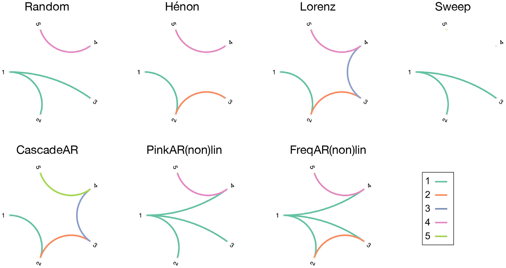

# Causality Analysis — Project Description

**Author:** Hanwei Liu
**Institution:** University Hospital Würzburg (UKW)
**Last Updated:** 2026-06-10

---

## Quick Start

Use Docker for manuscript reproduction because it gives every reader the same
software stack. Use the native Conda setup when you want to modify code locally
or develop the workflow.

### Recommended: Docker + JupyterLab

Clone the repository and enter the project directory:

```bash
git clone https://github.com/HanweiLiu-Viola/Causality-Analysis.git
cd Causality-Analysis
```

Pull the pinned Docker image:

```bash
docker pull viola1003/causality-analysis:v1.1.0
```

Start JupyterLab from the container:

```bash
docker run --rm -it -p 8888:8888 -v "$(pwd):/home/jovyan/work" viola1003/causality-analysis:v1.1.0
```

On Windows PowerShell, use `${PWD}` for the volume mount:

```powershell
docker run --rm -it -p 8888:8888 -v "${PWD}:/home/jovyan/work" viola1003/causality-analysis:v1.1.0
```

Open the JupyterLab URL printed in the terminal. Inside the container, this
repository is mounted at `/home/jovyan/work`.

### Tutorial Notebook Order

Run the notebooks in this order:

| Order | Notebook | Purpose |
|---|---|---|
| 1 | `notebooks/00_startup.ipynb` | Check required tools and start from the container entry point. |
| 2 | `notebooks/01_make_bids_data.ipynb` | Generate simulated BIDS EEG data. |
| 3 | `notebooks/02_run_connectivity_analysis.ipynb` | Run the minimal effective-connectivity analysis. |
| 4 | `notebooks/03_run_workflow.ipynb` | Preview the Snakemake workflow and verify outputs. |
| 5 | `notebooks/04_connectivity_benchmark.ipynb` | Optional benchmark across models and methods. |
| 6 | `notebooks/05_statistical_tests.ipynb` | Optional statistical validation examples. |

---

## Setup From Zero

These steps assume you are starting from a clean machine.

### Windows 11

Install Git for Windows, Docker Desktop with the WSL2 backend, and
Miniconda or Anaconda. Then open PowerShell:

```powershell
git --version
docker --version
conda --version
```

Clone the repository:

```powershell
git clone https://github.com/viola1003/Causality-Analysis.git
cd Causality-Analysis
```

Run the Docker tutorial environment:

```powershell
docker pull viola1003/causality-analysis:v1.1.0
docker run --rm -it -p 8888:8888 -v "${PWD}:/home/jovyan/work" viola1003/causality-analysis:v1.1.0
```

### macOS

Install Git, Docker Desktop, and Miniconda. If you use Homebrew:

```zsh
brew install git
brew install --cask docker miniconda
```

Start Docker Desktop, then check the tools:

```zsh
git --version
docker --version
conda --version
```

Clone the repository and run JupyterLab in Docker:

```zsh
git clone https://github.com/viola1003/Causality-Analysis.git
cd Causality-Analysis
docker pull viola1003/causality-analysis:v1.1.0
docker run --rm -it -p 8888:8888 -v "$(pwd):/home/jovyan/work" viola1003/causality-analysis:v1.1.0
```

### Linux / Ubuntu

Install Git, Docker Engine or Docker Desktop, and Miniconda. On Ubuntu:

```bash
sudo apt update
sudo apt install -y git ca-certificates curl
```

Install Docker using the current Docker documentation for your distribution,
then verify that Docker is available:

```bash
docker --version
docker run hello-world
```

Clone the repository and run JupyterLab in Docker:

```bash
git clone https://github.com/viola1003/Causality-Analysis.git
cd Causality-Analysis
docker pull viola1003/causality-analysis:v1.1.0
docker run --rm -it -p 8888:8888 -v "$(pwd):/home/jovyan/work" viola1003/causality-analysis:v1.1.0
```

---

## Native Conda Setup

Use this path when you are developing locally without Docker.

Create the notebook environment:

```bash
conda env create -f environment.yml
conda activate fc_jupyter
python -m ipykernel install --user --name fc_jupyter --display-name "Python (fc_jupyter)"
```

Create the Snakemake host environment:

```bash
conda env create -f environment_snakemake.yml
```

Launch JupyterLab:

```bash
conda activate fc_jupyter
jupyter lab
```

Run the workflow dry-run:

```bash
conda run -n snakemake-host snakemake --dryrun
```

Run the full workflow:

```bash
conda run -n snakemake-host snakemake --cores 1
```

Run targeted workflow rules:

```bash
conda run -n snakemake-host snakemake --cores 1 bids_convert
conda run -n snakemake-host snakemake --cores 1 connectivity_demo
conda run -n snakemake-host snakemake --cores 1 simulate
conda run -n snakemake-host snakemake --cores 1 run_fc
```

`fc_demo` is retained as a backward-compatible alias for `connectivity_demo`.

---

## Troubleshooting

| Problem | Fix |
|---|---|
| `docker` is not found | Install Docker Desktop or Docker Engine, start Docker, then reopen the terminal. |
| Port `8888` is already in use | Change the host port, for example `-p 8889:8888`, then open the printed URL with port `8889`. |
| Windows volume mount fails | Run the command from PowerShell in the repository directory and use `-v "${PWD}:/home/jovyan/work"`. |
| Files are missing in Docker | Confirm the project is mounted at `/home/jovyan/work` inside JupyterLab. |
| `snakemake` is not found | Create the host environment with `conda env create -f environment_snakemake.yml`, then run commands with `conda run -n snakemake-host ...`. |
| `fc_jupyter` is missing | Create the notebook environment with `conda env create -f environment.yml`. |
| `snakemake-host` is missing | Create it with `conda env create -f environment_snakemake.yml`. |

---
## 1. Project Overview

This project implements and benchmarks a suite of **Effective Connectivity (EC)**
methods for directed brain connectivity analysis. Given multichannel time-series data
(real or simulated), the main methods estimate a directed connectivity matrix
describing which signals influence which others and in which direction.

The codebase still uses `fc` in some filenames, class names, workflow rules, and
environment names for historical compatibility. In the manuscript context, the
primary interpretation is effective connectivity. Directional methods such as
ADTF, PDC, DTF, conditional Granger causality, PSI, and transfer entropy are the
main focus; non-directional measures such as PLI or MI are retained only as
comparison or auxiliary measures when they are used.

The main tutorial notebook validates synthetic examples against known
ground-truth causal structure using **AUC-ROC** and **Average Precision**.
The optional benchmark notebook still reports **Matthews Correlation
Coefficient (MCC)** for broader model/method comparisons.


---

## 2. Directory Structure

```
Causality-Analysis/
├── src/
│   ├── methods/
│   │   └── fc_pipeline.py          # Connectivity methods (legacy FCMethods class name)
│   ├── core/
│   │   └── mvarica.py              # MVAR model + ICA + MVARICA pipeline
│   ├── simulation/
│   │   └── simulation_models.py    # 9 simulation models with known GT
│   └── data/
│       ├── brain_data.py           # MNE-based EEG/MEG data loader
│       └── mne_loader.py           # MNEData class (lazy load, caching)
├── notebooks/
│   ├── 00_startup.ipynb            # Environment checks and container entry point
│   ├── 01_make_bids_data.ipynb     # Generate simulated BIDS EEG data
│   ├── 02_run_connectivity_analysis.ipynb  # Minimal random-model EC analysis
│   ├── 03_run_workflow.ipynb       # Snakemake workflow dry run and output checks
│   ├── 04_connectivity_benchmark.ipynb     # Optional benchmark notebook
│   └── 05_statistical_tests.ipynb  # Optional statistical validation notebook
├── figures/                        # Exported PDF + PNG figures
├── data/                           # Simulated data + benchmark/results files
├── requirements.txt                # Python dependencies
├── pyproject.toml                  # Package metadata (src/ layout)
└── PROJECT_DESCRIPTION.md          # This file
```

---

## 3. Simulation Models (`simulation_models.py`)

The simulation models implemented in this project are adapted from:
> Heyse, J., Sheybani, L., Vulliémoz, S., & van Mierlo, P. (2021).
> Evaluation of Directed Causality Measures and Lag Estimations in
> Multivariate Time-Series. *Frontiers in Systems Neuroscience*, 15,
> 620338. https://doi.org/10.3389/fnsys.2021.620338



All models generate 5-node time series with known directed connectivity.
Unified entry point: `simulate(model, T=1000, seed=None, **kwargs)`.


| Key | Function | Ground Truth Connectivity | Notes |
|---|---|---|---|
| `random` | `random_system` | x1→x2, x1→x3, x4→x5 | Fixed delays (2–5 samples), linear |
| `henon` | `henon_system` | x1→x2→x3, x4↔x5 | Nonlinear Hénon map |
| `lorenz` | `lorenz_system` | x1→x2→x3→x4→x5 (chain) | Coupled Lorenz oscillators (ODE) |
| `sweep` | `seizure_sweep` | x1→x2, x1→x3 | Frequency-swept seizure model + pink noise |
| `cascadear` | `cascade_ar` | x1→x2→x3→x4, x5→x4 | AR(2) cascade with bidirectional middle |
| `pinkarlin` | `pink_ar(nonlinear=False)` | x1→x2,x3,x4; x5→x4 | Pink-noise driven linear AR |
| `pinkarnonlin` | `pink_ar(nonlinear=True)` | x1→x2,x3,x4; x5→x4 | Same with quadratic coupling |
| `freqarlin` | `freq_ar(nonlinear=False)` | x1→x2,x3,x4; x2→x3; x5→x4 | Frequency-band specific coupling |
| `freqarnonlin` | `freq_ar(nonlinear=True)` | same as freqarlin | Nonlinear version |

All models apply z-score normalization (`zscore_normalize`) before returning.

---

## 4. Effective Connectivity Methods (`fc_pipeline.py`)

### 4.1 Class Structure

```
BasePreprocessor          — standardizes data to (epochs, nodes, time)
ADTFModel                 — VAR fitting + transfer matrix + ADTF computation
FCMethods                 — legacy class name; calls _<method>_func per method
```

### 4.2 Available Methods

| Method | Function | Internal Convention | Description |
|---|---|---|---|
| `ADTF` | `_adtf_func` | `[target, source]` | Adaptive DTF via VAR; integrated over frequency band |
| `PDC` | `_pdc_func` | `[target, source]` | Partial Directed Coherence via MVARICA |
| `DTF` | `_dtf_func` | `[target, source]` | Directed Transfer Function via MVARICA |
| `cGC` | `_cgc_func` | `[target, source]` | Conditional Granger Causality via VAR residuals |
| `PLI` | `_pli_func` | `[target, source]` (symmetric) | Phase Lag Index via MNE; non-directional comparison measure |
| `PSI` | `_psi_func` | `[source, target]` | Phase Slope Index via MNE; all pairs |
| `TE` | `_te_func` | IDTxl result | Multivariate Transfer Entropy (IDTxl) |
| `MI` | `_mi_func` | IDTxl result | Multivariate Mutual Information (IDTxl); non-directional comparison measure |

## 5. Tutorial Notebooks

The main tutorial uses four notebooks with simple, sequential names. Two
additional notebooks provide optional benchmark and statistical validation
material.

| Notebook | Purpose | Manuscript step |
|---|---|---|
| `00_startup.ipynb` | Check required tools and start the pinned Docker container. | Section 7.2 |
| `01_make_bids_data.ipynb` | Generate five simulated subjects and write a BIDS-compatible EEG dataset. | Section 7.3 |
| `02_run_connectivity_analysis.ipynb` | Run the minimal random-model effective-connectivity analysis and save figures. | Section 7.1 |
| `03_run_workflow.ipynb` | Preview the Snakemake workflow and verify expected outputs. | Section 7.5 |
| `04_connectivity_benchmark.ipynb` | Optional benchmark across models and EC methods. | Extension |
| `05_statistical_tests.ipynb` | Optional bootstrap, surrogate, and time-reversal validation examples. | Extension |

Start with `notebooks/00_startup.ipynb`. The benchmark and statistical
validation notebooks are retained as development/extension material, but they
are not required for the Section 7 tutorial.
